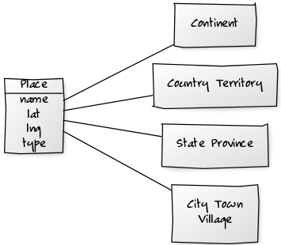

# worlddb-models

worlddb-models gem - world.db schema 'n' models for easy (re)use

* home  :: [github.com/worlddb/world.db.models](https://github.com/worlddb/world.db.models)
* bugs  :: [github.com/worlddb/world.db.models/issues](https://github.com/worlddb/world.db.models/issues)
* gem   :: [rubygems.org/gems/worlddb-models](https://rubygems.org/gems/worlddb-models)
* rdoc  :: [rubydoc.info/gems/worlddb-models](http://rubydoc.info/gems/worlddb-models)
* forum :: [groups.google.com/group/openmundi](https://groups.google.com/group/openmundi)

## Usage Models

Class Model Diagrams

Everything is a place.

`Country` Model - Example:

    at = Country.find_by! key: 'at'
    at.name
    # => 'Austria'
    at.pop
    # => 8_414_638
    at.area
    # => 83_871
    
    at.states.count
    # => 9
    at.states
    # => [ 'Wien', 'Niederösterreich', 'Oberösterreich', ... ]

    at.cities.by_pop
    # => [ 'Wien', 'Graz', 'Linz', 'Salzburg', 'Innsbruck' ... ]

`City` Model - Example:

    c = City.find_by! key: 'wien'
    c.name
    # => 'Wien'
    c.country.name
    # => 'Austria'
    c.country.continent.name
    # => 'Europe'

    la = City.find_by! key: 'losangeles'
    la.name
    # => 'Los Angeles'
    la.state.name
    # => 'California'
    la.state.key
    # => 'ca'
    la.country.name
    # => 'United States'
    la.country.key
    # => 'us'
    la.country.continent.name
    # => 'North America'

`Tag` Model - Example:

    euro = Tag.find_by! key: 'euro'
    euro.countries.count
    # => 17
    euro.countries
    # => ['Austria, 'Belgium', 'Cyprus', ... ]
    
    flanders = Tag.find_by! key: 'flanders'
    flanders.states.count
    # => 5
    flanders.states
    # => ['Antwerpen', 'Brabant Wallon', 'Limburg', 'Oost-Vlaanderen', 'West-Vlaanderen']
    flanders.states.first.country.name
    # => 'Belgium'

and so on.

## License

The `worlddb-models` scripts are dedicated to the public domain.
Use it as you please with no restrictions whatsoever.

## Questions? Comments?

Send them along to the [Open Mundi (world.db) Database Forum/Mailing List](http://groups.google.com/group/openmundi).
Thanks!
